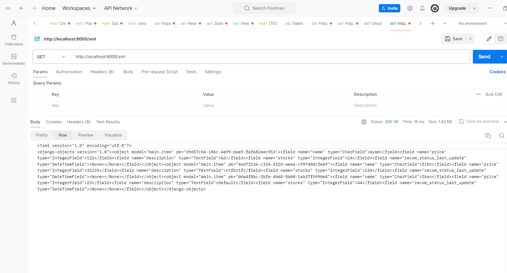

## Informasi

Nama : Vander Gerald Sukandi

NPM  : 1906350603

## Tugas 3 Menjawab Beberapa Pertanyaan


**1. Jelaskan mengapa kita memerlukan data delivery dalam pengimplementasian sebuah platform?**

Kita bisa mendefinisikan data delivery sebagai segala metode, protokol, format data (seperti json) yang melakukan transfer data dari satu bagian sistem ke bagian lain, atau dari satu sistem ke sistem lain yang berbeda. Hal ini melibatkan pengiriman, penerimaan, dan pemrosesan data sistem untuk memastikan bahwa data itu mencapai tujuan yang diinginkan. Nah, data delivery dibutuhkan untuk memampukan komunikasi antara dua bagian aplikasi web yang berbeda atau client dan server. Dengan kata lain, data delivery diperlukan supaya data bergerak dengan lancar dan aman sehingga website bisa memberikan konten dinamis, interaksi yang baik dengan user, dan integrasi dengan service lain di internet. Tanpa data delivery, dua bagian berbeda tidak bisa berkomunikasi.

**2. Menurutmu, mana yang lebih baik antara XML dan JSON? Mengapa JSON lebih populer dibandingkan XML?**

JSON lebih baik menurutku untuk aplikasi web berbasis Djangi. Lebih simpel, efisien, dan terlalu sering dipakai dibandingkan dengan XML saat berinteraksi dengan API dan pertukaran data.

JSON lebih populer karena lebih simpel dan bisa dibaca, standar format untuk JavaScript dan pertukaran data dalam aplikasi AJAX, didukung oleh REST frameworks dan API, memiliki compatibility dengan semua bahasa pemrograman yang popular. XML lebih kuno dan terkesan lebih verbose, dan tidak ringan.

**3. Jelaskan fungsi dari method is_valid() pada form Django dan mengapa kita membutuhkan method tersebut?**

Method is_valid() merupakan built-in yang disediakan untuk Form dan modelForm untuk melakukan validasi data yang dikumpulkan oleh user melalui form. Method itu melakukan validation check berdasarkan field dari form beserta validator , data cleaning, error collecting. Kita membutuhkannya supaya data itu dijamin valid dan integral dan mencegah error seandainya data invalid diproses. Dilakukan juga pembersihan data (cleaned_data pada form) yang mana method clean() bisa dilakukan kostumisasi jika butuh validasi dan pembersihan tambahan. Selain itu, kita juga mencegah input berbahaya seperti SQL injection atau XSS dengan validation.

**4. Mengapa kita membutuhkan csrf_token saat membuat form di Django? Apa yang dapat terjadi jika kita tidak menambahkan csrf_token pada form Django? Bagaimana hal tersebut dapat dimanfaatkan oleh penyerang?**

CSRF token dibutuhkan untuk melindungi website terhadap serangan Cross-Site Request Forgery (CSRF). Serangan CSRF terjadi jike website licik menipu client dengan memintanya melakukan submit action-action tertentu di aplikasi web yang mana user terautentikasi. Menyertakan csrf token dengan  di dalam elemen <form> dalam template html Django, memastikan bahwa terjadi verifikasi bahwa request datang dari website kita dan bukan sumber lain.Akan ada input field tersembunyi dengan token unik yang terkait dengan session user saat melakukan csrf.Ketika form submit, Django akan mengecek token itu dan membandingkan apakah berpasangan dengan yang disimpan di session user. Jika tidak, Django menolak request dan mencegah aksi yang tidak terotorisasi. Jika tidak menggunakan csrf token, attacker bisa membuat manipulasi sehingga user melakukan request yang tidak legit untuk form tersebut.


**5. Jelaskan cara kamu mengimplementasikan checklist di atas secare step-by-step**

Membuat forms.py. Mengimplementasikan ItemEntryForm sesuai dengan model Item yang ada. Tentu saja mengingat import
Mengubah template first_page.html dengan menambahkan it_entries dan beberapa baris untuk menampilkannya,
Membuat create_item_entry di views.py . Menambahkan elemen context baru untuk menampilkan item_entries di template first_page.html di first_page.
Membuat create_item_entry.html dengan melihat form dari forms.py . Ingat csrf_token . 
Membuat views untuk json dan xml, kemudian json untuk id, xml untuk id
Menambahkan
```
path('simple_item_form/', create_item_entry, name='create_item_entry'),
path('xml/', show_xml, name='show_xml'),
path('json/', show_json, name='show_json'),
path('xml/<str:id>/', show_xml_by_id, name='show_xml_by_id'),
path('json/<str:id>/', show_json_by_id, name='show_json_by_id'),
```
ke `urls.py` beserta import functions dari views yang sesuai. 

**6. Postman**

Hasil screenshoot 




deploy di : dusty-penguin-fasilkomui-750583cd.koyeb.app